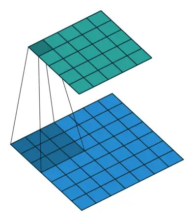
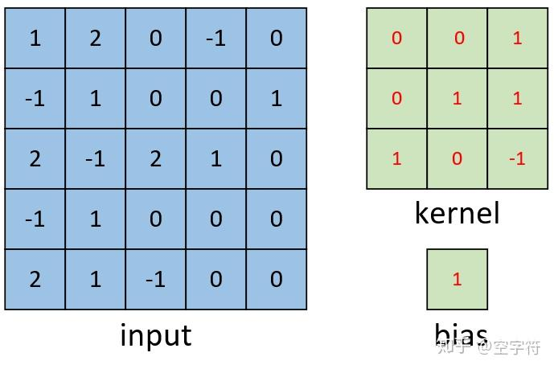
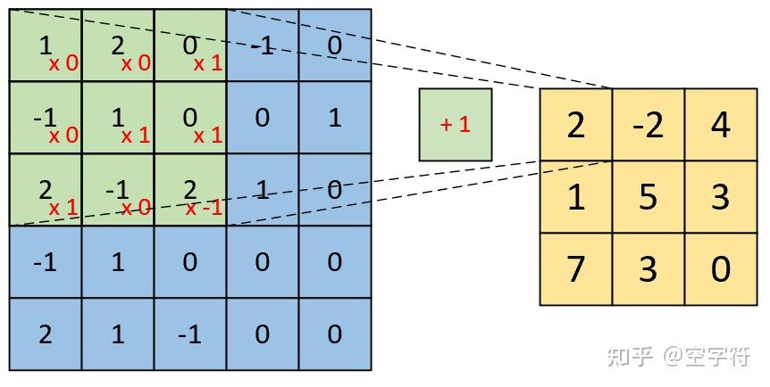
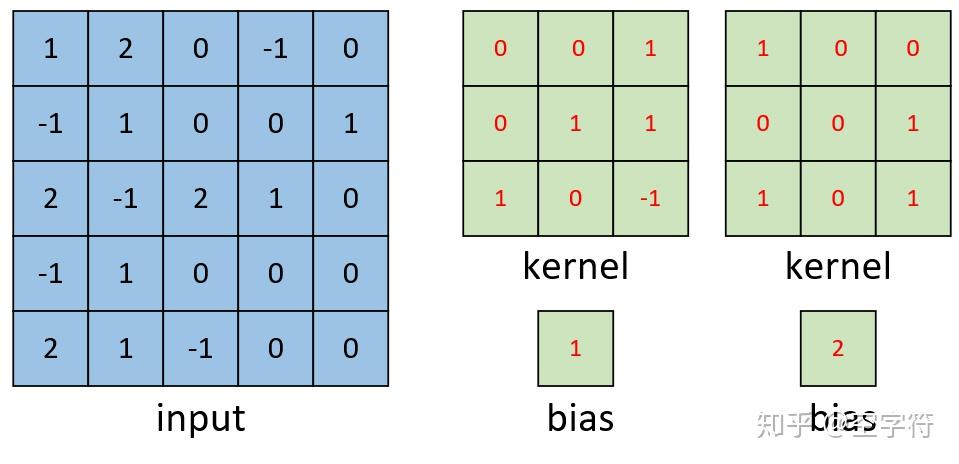
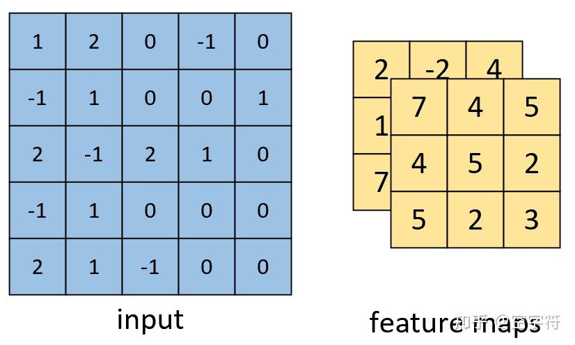
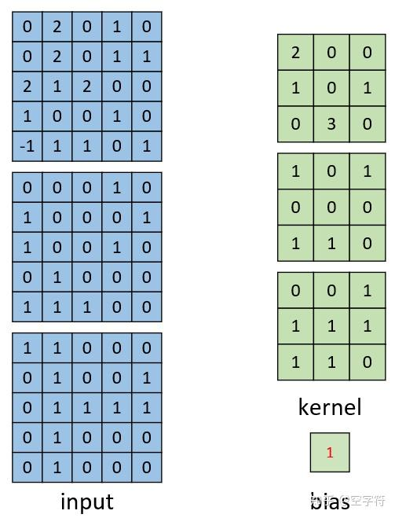
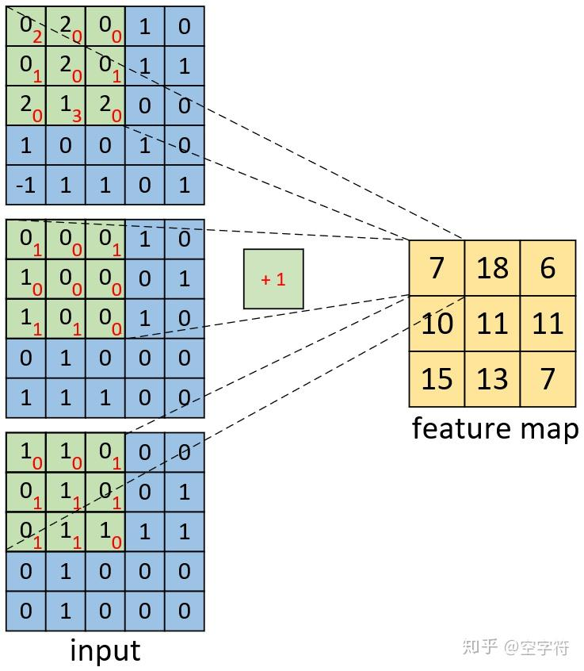
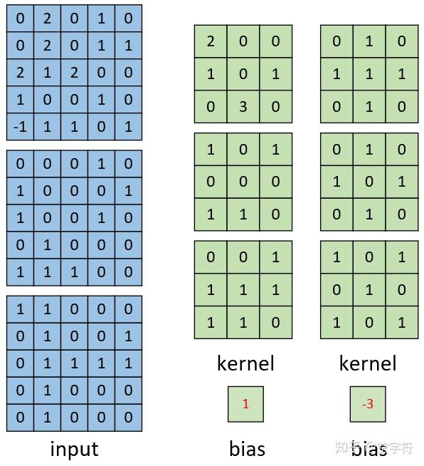
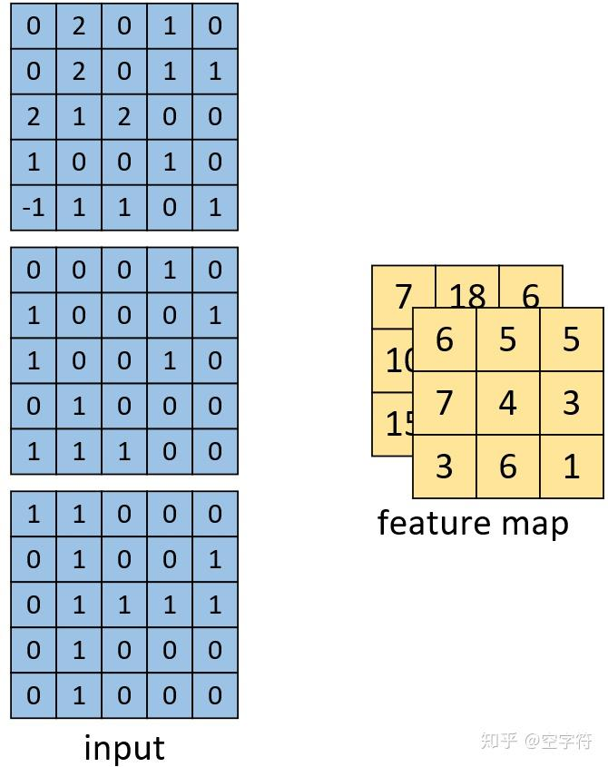

# Convolutional Neural Networks

[REVIEW: What Is CNN on ZHIHU](https://zhuanlan.zhihu.com/p/561991816)

A variation of MLP.

> Inspired by cat's visual cortex

## Features:
- Local receptive field 局部感受野
- Weight sharing 权值共享
- Pooling 池化层

Cope:
- Reduce the number of the parameters of the model
- Ease the overfitting problem

## How convolution is calculated
### Definition:

Choose ==a certain size of **matrix F**  (the blue shadow part)==
- input: the blue matrix, the matrix X
- execution: scan in a row and use **dot multiply（内积）**
- value: the green shadow part (after caculation)
- output: the green matrix, the matrix Y

Names:
- Convolution kernel(kernel,filter,detector): the matrix F
- Feature map: the matrix Y
> Notice: Feature map and the convolution kernel has a correspondent relationship

- To describe the matrix X
	- width
	- high
	- channel 通道数

### Multiple convolution kernels
And we use multiple convolution kernels to extract different types of features.
This is especially important in the case of difficult objects.

### Calculation steps
#### Single channel single convolution kernel

Let the kernel iterates the input matrix and use the dot multiply:

And the bias is used to adjust the calculation of the dot multiply of two matrix:

And the feature map can be described as: $[3,3,1]$

#### Single channel multiple convolution kernels
What if we have two convolution kernels:

The result:

And the feature maps can be described as :$[3,3,2]$

#### Multiple channels and single convolution kernel

> Notice that the "single" in the name of this part is that one input matrix correspond to one convolution kernels, and multiple input matrix form "multiple channels".

Input and convolution kernels:

the caculation:

 Notice that BIAS is used only once, in the end of this calcualtion.

#### Multiple channels and multiple convolution kernels

Of the left convolution kernel, the calculation has been done upside. So for the right convolution kernel, it is just to add a feature map.

