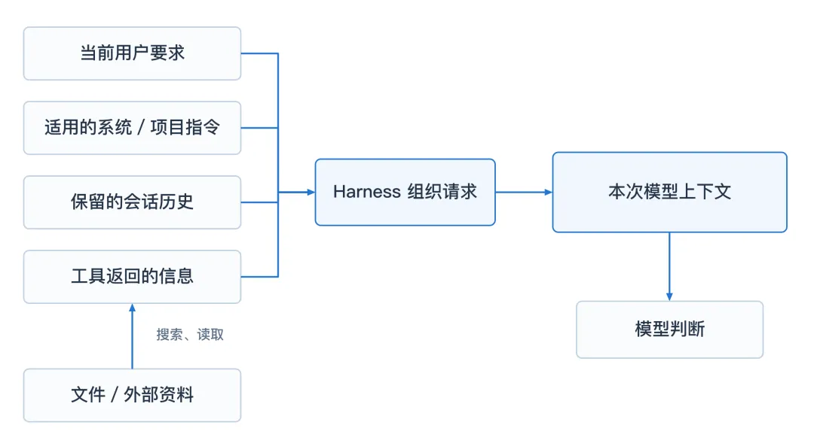
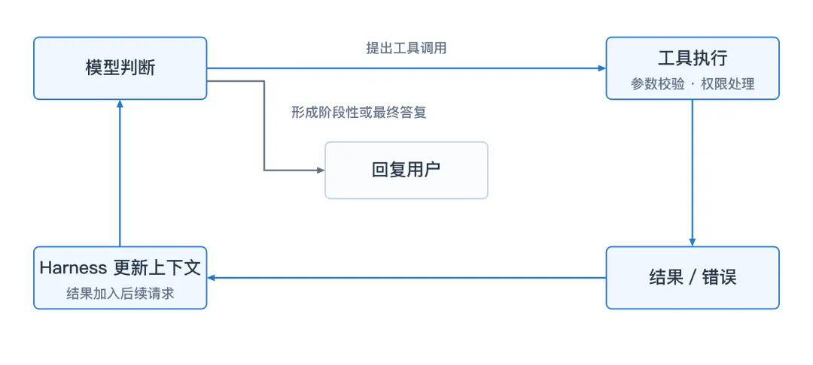
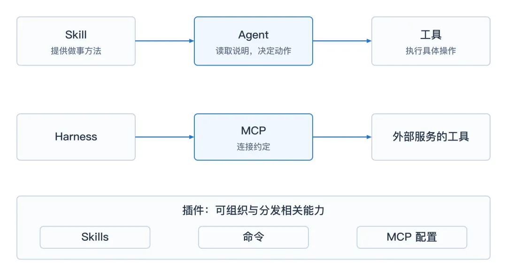
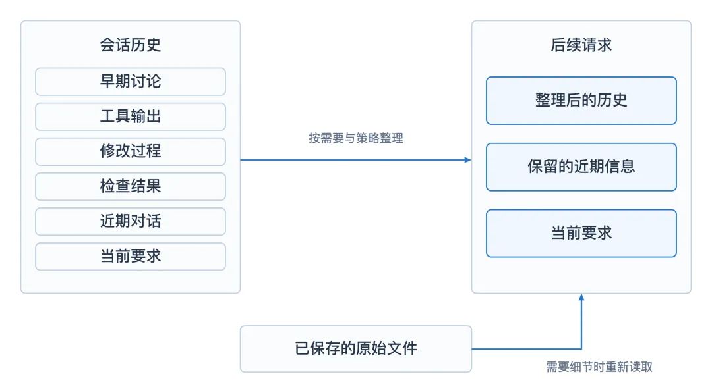

# How Do AI Agents Work?

[How does agent work by 赛博禅心](https://mp.weixin.qq.com/s/EQMPyo5FVCFvy0mndcBkMQ)

## Why learn this?
- I am very curious about how agents work after getting to know how much they can do
- I need to ensure that my work is being done in a correct way when I am using agent
- I still remember the time when I used claude code cli and these CLI tool and was totally amazed by them.

Harness arrange the things :
- request
- file, data etc
- history
- information of function call

### How does agent keep working after one sentence?

After the user give out request, the model judges and use function calls, and use the feedback of function calls to update the harness's context, then the model compares the feedback and the request, then the loop again.

Function calls:
- Help the model take action
- Update the model with the state-of-art

### Gradual loading of skills

Skill tells the model what to do 
- How to cope with different circumstances
- How to evaluate the work done

Tools themselves involve how to use tools, how to input data, execute the program and output the data, and what tools to call after this tool.

MCP: Manage how to connect the outside tools.

### The memory chain of the long term tasks

Three layers of memories:
- The model's current context
- In this session
- In the projects files

### Use subagents
Use subagents to make the main agent more clear and more efficient.

Notice
- Distribute jobs to different agents
- What I expect of each agent

### Interruption in law
The agent should be ready to accept new input and deal with the node in rule and update the context.
