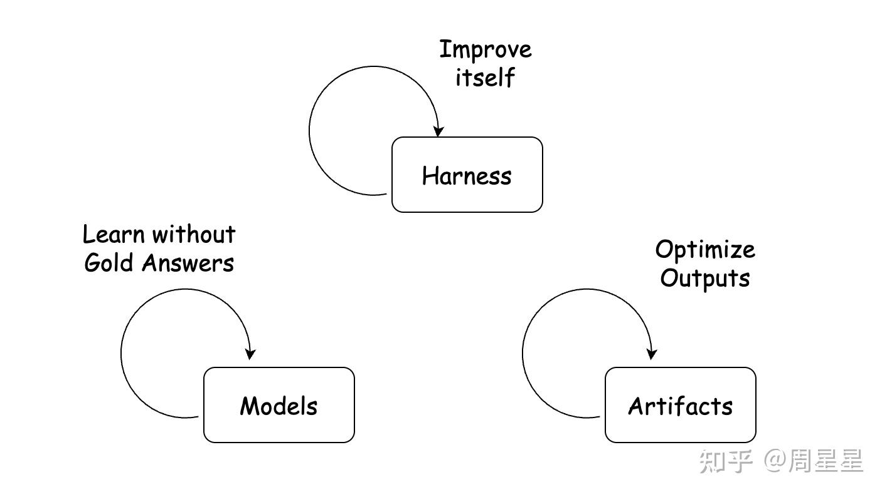
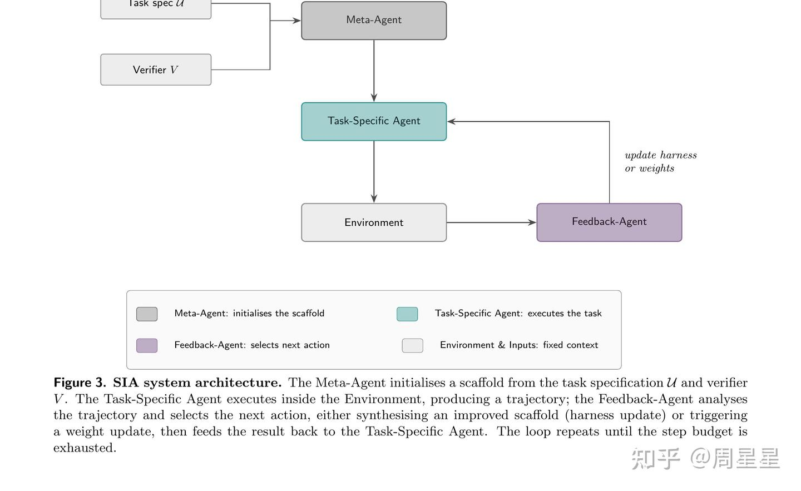

# Recursive Self-Improvement

RSI(Recursive self-improvement) is gonna be one of the most important technologies that help build AI a better tool.

### What is RSI and first what is AI training

**Three** layers to train(RSI):
- Artifacts: The production (outputs) of AI agents, like the report file, code file, generated images etc--Help this session output better results
- Harness: Prompt, skill, memory, plugin, tool……--Help agent work better in a long time.
- Model : Optimize the parameters  --The model itself improves, more fundamental

**Iterates in a loop**

Researches till now mainly focuses on the training of Harness layer, cuz it's the easiest and most portable compared to other two.

An interesting finding:
- SIA: Self Improving AI with Harness & Weight Updates
	- Iterates both the harness and model

SIA-W+H >> SIA + H
