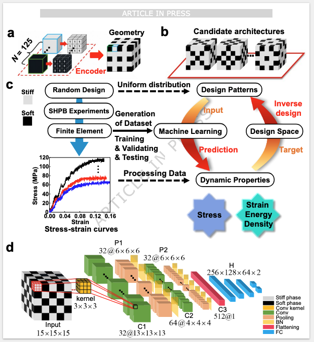

# Machine learning-driven optimization of highvelocity impact resistance for three-dimensional biphasic composites
Bu, L., Wang, P., Hao, S. _et al._ Machine learning-driven optimization of high-velocity impact resistance for three-dimensional biphasic composites. _Nat Commun_ **17**, 9819 (2026). https://doi.org/10.1038/s41467-026-76632-y

### 背景
高速撞击、“鸟撞”到复合材料上（这是一个高应变率事件$10^3 s^{-1}$)，，微观结构会导致不可避免的应力不均匀，应力波传播和局部升温，以及应变速率硬化导致的非线性变形和局部化，为了缓解这个压力局部化的问题和衰减的问题，他们基于$3D-CNN$，提出了这个定量的将微观结构和双相复合材料的**动态响应/动态力学性能**之间的关联，并在了解此关联后，进行预测并且反向设计：
1. 通过空间分析相分布直接**预测动态力学性能**
2. 并且在预测得到动态力学性能的基础上进行**逆向设计**


论文优化的量化目标是
- 动态应力均匀性 Dynamic stress uniformity
- 动态承载能力 Dynamic load capacity

提升效果：
-  Dynamic stress uniformity：21.54% --> 97.45%
- Dynamic load capacity: 22% --> 57%
Overall: Machine learning driven approach can improve **dynamic stress equilibrium.** 并且对于软的材料和硬的材料都适用。

后续应用：航空飞机、汽车材料的设计。
（飞机可能会撞到鸟和大厦，汽车可能撞到各种东西，并且都容易在高速在撞到。因此，这个工作如果能够应用的话，如果应力均匀性能提高那么多，并且应力承载能力也能提升不少的话，那么飞机和汽车就更加耐撞，并且被撞的均匀性也会提高。）

### 引入
人们从贝母、骨、跟腱这些生物的结构（这些生物结构既有软物质的高韧性和延展性，又有硬物质的强度和刚性）中获取灵感，希望能够打造**一种在不同的撞击速度下，都能够表现出综合珍珠层状和层压的结构策略。** 

提到了 “Biphasic composites” 双相复合材料

用了2022 年发在 Science Advances 上的关于某种纤维的研究，以及后面的Nature Communications，都是想要说明，结构性能和热学性能是可以兼得。

**strength/energy absorption while addressing thermal management** 



1.c:
```
真实实验 SHPB
      ↓
验证 / 校准 FEM
      ↓
FEM 批量模拟随机结构
      ↓
结构 + peak stress + SED
      ↓
训练 CNN
```
